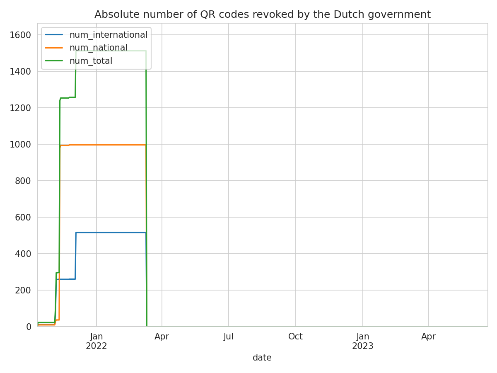

# coronacheck-denylist
This repo keeps track on the number of blocked DHC / EHC QR codes by the Dutch government.

NEW!: [Download the list of all blocked QR code hashes over time](data/all_blocked_qr_code_hashes.csv)

[data/latest-denylist.csv](data/latest-denylist.csv)
